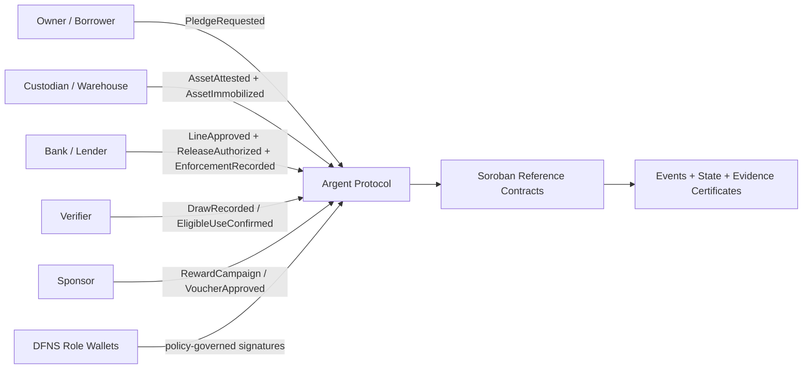
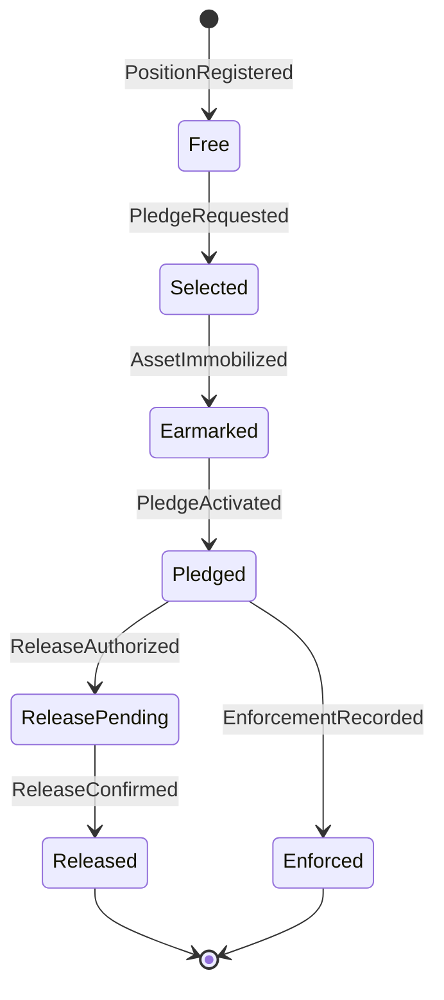
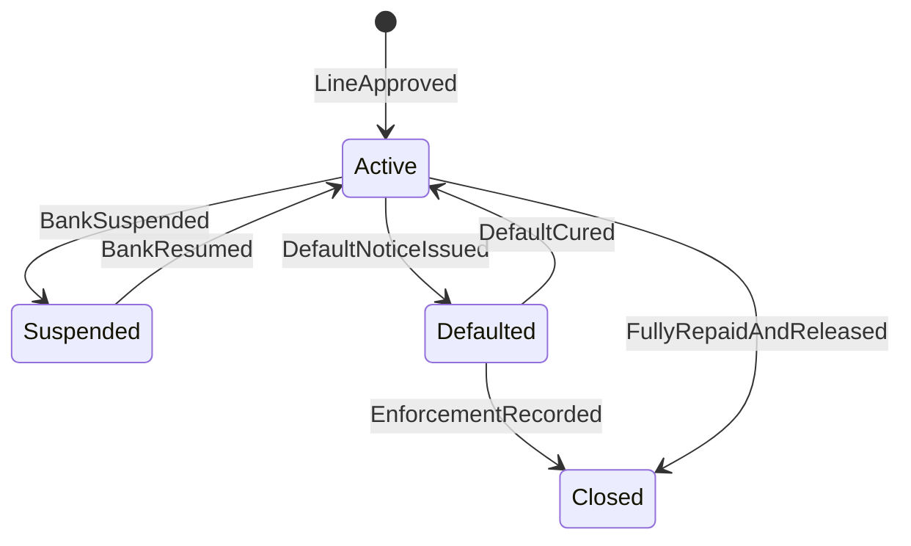
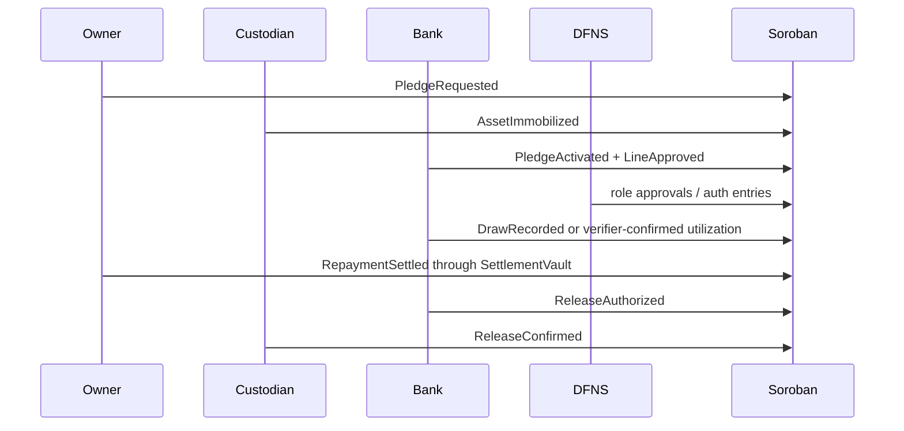
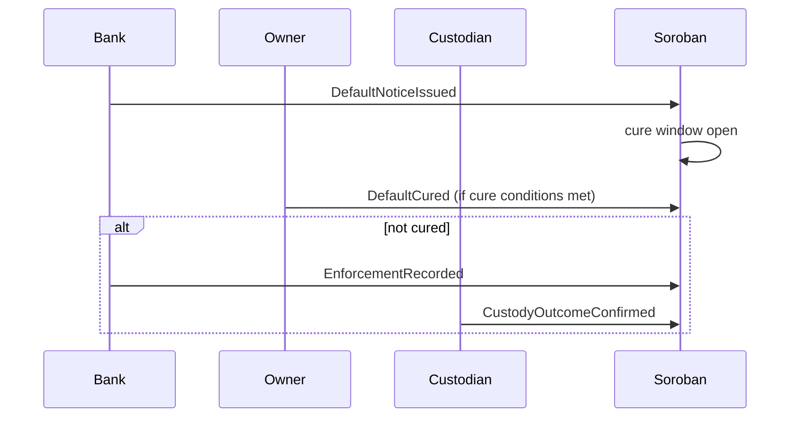

# Argent Protocol Whitepaper

**Event-sourced physical collateral control for assets that remain in custody.**

**Public core specification v0.1**  
**Reference implementation:** Soroban / Stellar  
**First asset adapter:** allocated physical gold  
**First application:** DFNS-governed physical collateral book of record on Stellar

> Public document. This whitepaper defines the open protocol core. It intentionally excludes commercial strategy, partner pipeline, pricing, private deployment plans, and institution-specific legal analysis. Those belong in a private companion document. The current SCF Build scope remains narrower: ship the Soroban reference implementation and DFNS-governed mainnet application. The protocol described here is the larger public direction that the reference implementation proves.

---

## Abstract

Argent Protocol is an open, event-sourced protocol for controlling and proving the lifecycle of physical collateral that remains in professional custody. It does not tokenize the asset, hold title, custody the asset, lend money, issue credit, or enforce legal remedies. Instead, it records the ordered chain of signed collateral-control events that make a physical asset usable as bank collateral: identity, custody attestation, immobilization, pledge, line approval, drawdown, revaluation, repayment, release, default, cure, enforcement evidence, and audit trail.

The first reference implementation is written in Soroban on Stellar. The first asset adapter is allocated physical gold because allocated custody already has mature evidence primitives: bar serial numbers, barlists, allocation records, custodian acknowledgements, settlement confirmations, and audit records. The first application uses DFNS-governed role wallets so each institution signs only the action it controls.

The protocol thesis is simple:

> Physical collateral does not need to become a token to become programmable collateral. It needs a shared, signed, replayable record of the control events that govern it.

Argent Protocol therefore treats collateral as an event sequence, not as a tradable ownership token. DFNS governs who signs. Soroban preserves what happened. The asset stays in custody.

---

## 1. Scope and status

This document defines the **public protocol core**. It is intended for developers, reviewers, auditors, SDF/SCF evaluators, custodians, banks, and future contributors who need to understand the open architecture behind Argent.

### 1.1 What this document covers

This public whitepaper covers:

- the problem Argent Protocol solves;
- the design principles;
- the actor and authority model;
- the event model;
- the state machine;
- the evidence model;
- the allocated-gold adapter;
- the Soroban reference architecture;
- the role-policy model for DFNS-governed signing;
- security properties and residual risks;
- implementation snippets and expected open-source components;
- a cautious chain-portability path.

### 1.2 What this document does not cover

This document does **not** cover:

- commercial pricing;
- bank/custodian target lists;
- private partner strategy;
- deployment-specific legal opinions;
- jurisdiction-specific enforceability analysis;
- production KYC/AML design;
- confidential risk models;
- hosted UI or SaaS monetization;
- future private integrations.

### 1.3 Relationship to the SCF Build submission

The current SCF Build submission is narrower than this protocol vision. It funds a 12-week implementation path: take the tested Soroban prototype to a DFNS-governed mainnet reference deployment and open-source the reusable DFNS and Soroban authorization adapter.

This whitepaper shows why that build matters beyond one app. It does **not** expand the funded scope.

### 1.4 Implementation status and the protocol/contract boundary

The current Soroban contracts implement the core lifecycle invariants described in this document: framework registration, position registration, collateral selection, custodian immobilization, pledge activation, credit line opening, drawdown and reversal, repayment, collateral adjustment, revaluation and margin, release, default and cure, enforcement readiness, and enforcement recording.

Some objects in this document, including the canonical `CollateralEvent`, the `EvidenceRef` and `EvidenceFunction` model, and the adapter schemas, are protocol-level normalization objects. They describe how the open protocol should expose, normalize, and index the underlying contract state and events for indexers, evidence certificates, and protocol-facing tooling. They are not claimed to be the exact in-contract struct names. Where a contract API name differs from a protocol name, the Soroban event mapping in section 9.3 and the reference implementation are authoritative.

---

## 2. Terminology and requirement keywords

The key words **MUST**, **MUST NOT**, **REQUIRED**, **SHOULD**, **SHOULD NOT**, **RECOMMENDED**, **MAY**, and **OPTIONAL** are used in the sense of RFC 2119 and RFC 8174 when written in uppercase.

| Term | Meaning in Argent Protocol |
|---|---|
| Physical collateral | A physical asset held by a custodian or warehouse and used to secure credit. |
| Allocated gold | Specific gold bars legally assigned to an owner, identified through bar serial numbers, refiner marks, weight, fineness, and custody records. |
| Control event | A signed protocol event that changes or proves the collateral-control state. |
| Event mirror | The on-chain sequence that mirrors real-world collateral acts without owning or moving the asset. |
| Evidence function | The purpose a document or hash serves: identity, authority, settlement, title, custody, valuation, release, movement, enforcement, audit. |
| Authority | The right of a role to sign a specific event for a specific collateral reference. |
| Role wallet | A wallet controlled by a specific actor or authority class, such as bank-release authority or custodian-control authority. |
| Custody-native | A design where the asset remains with the existing custodian while control events are recorded and enforced through protocol state. |
| Reference implementation | The first concrete implementation of the protocol. In v0.1, this is Soroban on Stellar. |

---

## 3. Problem statement

Physical collateral has value, but institutional credit requires more than value. A bank must know what the asset is, where it is, who controls it, whether it is already pledged, what credit it supports, whether it can be released, and what happens on default.

Today these facts are fragmented across:

- custody books;
- allocation records;
- warehouse receipts;
- barlists;
- invoices;
- bank settlement messages;
- pledge agreements;
- custody-control agreements;
- valuation files;
- emails;
- legal opinions;
- internal credit systems;
- audit certificates.

The result is not a lack of collateral. It is a lack of shared control evidence.

### 3.1 The collateral movement problem

Institutional collateral workflows often force a bad choice: move the asset to make it financeable, or keep it safe in custody and lose financing utility. In digital/tokenized markets, this is described as the collateral movement problem: borrowing workflows force collateral to move out of custody to the lender, a margin venue, or a third party, creating counterparty risk, settlement delay, legal work, and capital inefficiency. PCP addresses that problem for tokenized assets through custody-native credit infrastructure.

Argent Protocol applies the same structural insight to **physical collateral that should remain physical**. The protocol does not solve tokenized collateral. It solves the harder non-tokenized case: the asset has no wallet, no balance, no token contract, and no native digital transfer primitive. What can become programmable is not ownership of the asset, but control over the events that affect the asset's collateral status.

### 3.2 The gold documentation problem

Allocated physical gold already has a strong documentary system. Wholesale transactions produce a phased evidence set: onboarding file, contract and invoice, MT103 settlement confirmation, allocation record, and where movement occurs, a delivery dossier. Each document appears in sequence and performs a specific job that the next document depends on.

Allocated custody also depends on bar-level identity: a bar serial number, refiner mark, fineness, weight, year or casting details, and a custody-side record that names the owner against the serial. The bar and custody record must be read together.

This confirms the core design of Argent Protocol:

> Physical collateral control is not one state. It is a sequence of evidence-bearing events.

### 3.3 The missing layer

The missing layer is not a token. It is a shared, signed, replayable control record.

Argent Protocol creates that layer by transforming real-world acts into ordered collateral events:

```text
owner requests -> custodian confirms -> bank approves -> line opens -> draw records -> value changes -> repayment settles -> release or default outcome records
```

The protocol gives every party the same map of who did what, under what authority, against which asset, at what time, with what evidence.

---

## 4. Conceptual model

Argent Protocol is best understood as three ideas combined.

### 4.1 Event-sourced collateral control

Event sourcing records the full series of events that describe actions taken in a domain in an append-only store. Argent applies that pattern to physical collateral. It does not store only the latest state, such as `Pledged`. It stores the ordered event chain that made `Pledged` legitimate.

The current state is derived from prior events:

```text
PledgeRequested
AssetAttested
AssetImmobilized
PledgeActivated
LineApproved
DrawRecorded
RepaymentSettled
ReleaseAuthorized
ReleaseConfirmed
```

The protocol value is not merely the current state. It is the ability to replay how that state became true.

### 4.2 Digital twin of the lifecycle, not the asset

A digital twin is a digital representation of assets, environments, or business systems. Argent uses a narrow version of that idea: it is **not** a twin of the physical bar itself. It is a twin of the collateral lifecycle around the bar.

Argent does not model a gold bar as a digital object to be owned or traded. It models the ordered control events around that bar:

- who identified it;
- who confirmed custody;
- who immobilized it;
- who approved the pledge;
- who opened the line;
- who recorded utilization;
- who settled repayment;
- who authorized release;
- who confirmed release;
- who recorded enforcement.

### 4.3 Chain of control

Chain of custody records the chronological handling, transfer, and safeguarding of evidence. Argent Protocol borrows the chronology and accountability logic, but applies it to collateral control rather than physical evidence handling.

A physical asset may never move. The relevant chain is therefore not only custody movement. It is **control movement**:

```text
free -> selected -> immobilized -> pledged -> drawn -> repaid -> released
```

or, under stress:

```text
free -> selected -> immobilized -> pledged -> drawn -> default noticed -> cure expired -> enforcement recorded
```

---

## 5. Design principles

### Principle 1: Do not tokenize what should remain allocated

Argent Protocol MUST NOT require a physical asset to become a tradable ownership token. Tokenization may be useful for assets designed to move and settle digitally. Physical collateral often needs the opposite: the asset stays where it is, while control becomes programmable.

### Principle 2: Separate title, custody, credit, and control

The protocol MUST distinguish:

- legal title evidence;
- custody evidence;
- credit exposure;
- control events;
- repayment settlement;
- release and enforcement evidence.

These are related, but not the same.

### Principle 3: Preserve role separation

Each actor MUST sign only the acts it controls. A platform operator MUST NOT sign as owner, custodian, bank, verifier, or sponsor unless explicitly authorized as that role in a test environment.

### Principle 4: Record events, not private documents

The protocol SHOULD store hashes, references, and typed evidence functions on-chain. It MUST NOT store private legal documents, KYC data, barlists, invoices, MT103 messages, customer files, or commercially sensitive data in plaintext.

### Principle 5: Sequence creates legitimacy

Rights depend on causal order. A final state alone is not enough. The protocol MUST enforce preconditions for each state transition.

### Principle 6: Repayment does not equal release

Repayment reduces exposure. It MUST NOT automatically release collateral. Release requires a separate bank authorization and custodian confirmation.

### Principle 7: The chain records enforcement; law and custody enforce

The protocol MUST NOT claim to seize, sell, or transfer physical assets by itself. It records default, cure, enforcement instructions, and enforcement outcomes as signed evidence.

### Principle 8: Shared truth does not require full disclosure

Participants SHOULD be able to verify relevant state and evidence commitments without seeing all private documents.

### Principle 9: Chain-portable specification, Soroban-first implementation

The protocol SHOULD define chain-neutral concepts. The first reference implementation is Soroban because Soroban's authorization model fits role-signed collateral workflows.

---

## 6. Public architecture overview



Argent Protocol has four public layers:

1. **Event schema**: how collateral events are typed, signed, referenced, and replayed.
2. **State machine**: which state transitions are valid.
3. **Evidence model**: how document hashes and evidence functions attach to events.
4. **Reference contracts**: the Soroban implementation of the event and state model.

A production deployment may add private services around these public layers: UI, onboarding, legal templates, KYC, monitoring, custody integration, bank dashboards, reconciliation, analytics, and commercial support. Those are outside the public core.

---

## 7. Actors and authorities

### 7.1 Required roles

| Role | Purpose | Example actions |
|---|---|---|
| Owner / borrower | Owns the physical asset and requests use as collateral. | request pledge, select collateral, repay, claim rewards |
| Custodian / warehouse | Holds the asset and confirms custody status. | attest asset, immobilize, confirm release, confirm enforcement outcome |
| Bank / lender | Extends secured credit and controls release/enforcement rights. | approve pledge, open line, suspend, release, default, enforce |
| Verifier | Confirms utilization or external business evidence. | verify posted spend, confirm eligible use |
| Sponsor | Funds optional reward campaigns. | create campaign, approve voucher, confirm redemption |
| Operator | Builds transactions, indexes events, renders evidence. | route approvals, fee sponsor, index, certify |

### 7.2 Authority separation

A deployment SHOULD split bank authority into separate role wallets:

```text
BankCreditAuthority
BankReleaseAuthority
BankEnforcementAuthority
```

This prevents one operational key from approving a line, releasing collateral, and recording enforcement. A serious bank will expect this separation.

### 7.3 Role-action matrix

```text
Owner / cardholder:
  MAY request pledge
  MAY select collateral
  MAY sign the settlement-asset transfer that funds a repayment
  MAY claim rewards
  MUST NOT open a line as bank
  MUST NOT confirm custody as custodian
  MUST NOT apply a repayment to the credit line directly

Custodian:
  MAY attest existence
  MAY immobilize collateral
  MAY confirm release
  MAY confirm enforcement outcome
  MUST NOT open credit line
  MUST NOT authorize release as bank

Bank:
  MAY approve eligibility
  MAY open credit line
  MAY authorize release
  MAY issue default notice
  MAY record enforcement outcome
  MUST NOT confirm physical custody

Verifier:
  MAY confirm eligible utilization
  MUST NOT approve pledge or release

Sponsor:
  MAY create reward campaign
  MAY approve reward voucher
  MUST NOT act on credit or custody state

Operator:
  MAY build and submit transactions
  MAY index and certify evidence
  MUST NOT act as business authority for another role

Vault (settlement contract):
  MAY execute the settlement-asset transfer for a repayment
  MAY call the credit ledger to apply that repayment to the line
  MUST be an approved Vault-role party for the call to be accepted
  MUST NOT open lines, authorize release, or act on custody state
```

The repayment path is deliberately two-legged. The owner or cardholder signs the
settlement-asset transfer in the settlement vault. The settlement vault, acting
as an approved Vault-role party, then calls the credit ledger to apply that
repayment to the line. The bank does not apply the repayment, and the owner
cannot write to the line directly. This separation is why a repayment cannot be
forged or misapplied by any single party.

---

## 8. Protocol event model

The protocol's core object is the `CollateralEvent`.

A signed collateral event answers eight questions:

1. Who acted?
2. Under what authority?
3. Against which asset?
4. What state changed?
5. What value changed?
6. What condition was satisfied?
7. What evidence proves it?
8. When did it happen?

### 8.1 Canonical event object

Illustrative JSON form:

```json
{
  "protocol": "argent.protocol",
  "version": "0.1",
  "event_id": "0x...",
  "event_type": "AssetImmobilized",
  "facility_id": "0x...",
  "position_id": "0x...",
  "pledge_id": "0x...",
  "credit_line_id": null,
  "asset_ref": {
    "asset_class": "allocated_gold",
    "asset_id_hash": "0x...",
    "barlist_hash": "0x...",
    "serials_hash": "0x..."
  },
  "actor": {
    "role": "Custodian",
    "signer": "G...",
    "authority_ref": "custody-control-policy-v1"
  },
  "state": {
    "before": "Selected",
    "after": "Earmarked"
  },
  "value": {
    "currency": "CHF",
    "amount_delta_minor": "0",
    "collateral_value_minor": "33000000",
    "borrowing_base_minor": null
  },
  "condition": {
    "satisfied": "OwnerSelectionExists",
    "depends_on": ["PledgeRequested"]
  },
  "evidence": [
    {
      "function": "Custody",
      "hash": "0x...",
      "label": "custodian_acknowledgement"
    },
    {
      "function": "AssetIdentity",
      "hash": "0x...",
      "label": "barlist"
    }
  ],
  "ledger": {
    "chain": "stellar",
    "network": "testnet",
    "contract_id": "C...",
    "tx_hash": "0x...",
    "ledger_sequence": 123456
  },
  "time": {
    "observed_at_ledger": 123456,
    "source_time": "2026-06-25T10:00:00Z"
  }
}
```

### 8.2 Rust-style protocol struct

Illustrative chain-neutral Rust model:

```rust
#[derive(Clone, Debug, PartialEq, Eq)]
pub struct CollateralEvent {
    pub protocol: &'static str,
    pub version: &'static str,
    pub event_id: [u8; 32],
    pub event_type: EventType,
    pub facility_id: [u8; 32],
    pub position_id: Option<[u8; 32]>,
    pub pledge_id: Option<[u8; 32]>,
    pub credit_line_id: Option<[u8; 32]>,
    pub asset_ref: AssetRef,
    pub actor: ActorRef,
    pub state: StateDelta,
    pub value: Option<ValueDelta>,
    pub condition: ConditionRef,
    pub evidence: Vec<EvidenceRef>,
    pub ledger: LedgerRef,
    pub time: EventTime,
}

#[derive(Clone, Debug, PartialEq, Eq)]
pub enum EventType {
    FrameworkRegistered,
    PositionRegistered,
    PledgeRequested,
    AssetAttested,
    AssetImmobilized,
    PledgeActivated,
    LineApproved,
    DrawRecorded,
    DrawReversed,
    RevaluationPosted,
    MarginCalled,
    RepaymentSettled,
    ReleaseAuthorized,
    ReleaseConfirmed,
    SubstitutionRequested,
    SubstitutionApproved,
    DefaultNoticeIssued,
    DefaultCured,
    EnforcementReadinessOpened,
    EnforcementReadinessPopulated,
    EnforcementRecorded,
    EvidenceCertificateIssued,
}
```

### 8.3 Evidence function enum

```rust
#[derive(Clone, Debug, PartialEq, Eq)]
pub enum EvidenceFunction {
    Identity,
    Authority,
    CommercialTerms,
    Settlement,
    Title,
    Custody,
    AssetIdentity,
    Valuation,
    Insurance,
    Audit,
    Movement,
    Release,
    DefaultNotice,
    Cure,
    Enforcement,
    Reward,
}
```

The evidence function is required because not all hashes prove the same thing. A barlist proves asset identity. An MT103 proves settlement. A custody acknowledgement proves custody. A board resolution or signatory list proves authority. Collapsing these into one generic evidence hash loses meaning.

---

## 9. Event taxonomy

### 9.1 Core collateral events

| Event | Required signer | Effect |
|---|---|---|
| `FrameworkRegistered` | Owner + bank + custodian, or agreed admin during setup | Anchors facility, pledge, custody, eligibility, margin, and enforcement document hashes. |
| `PositionRegistered` | Custodian or operator under custody evidence | Creates a physical asset position by hash and usable collateral fields. |
| `PledgeRequested` | Owner | Owner designates a position for collateral use. |
| `AssetImmobilized` | Custodian | Custodian confirms the asset exists and is blocked under the control framework. |
| `PledgeActivated` | Bank | Bank accepts collateral as security. |
| `LineApproved` | Bank | Opens a credit line against borrowing base and policy. |
| `DrawRecorded` | Verifier / processor / bank-approved role | Records utilization and reduces available capacity. |
| `RevaluationPosted` | Valuation role | Posts a fresh valuation and recomputes borrowing base. |
| `MarginCalled` | Contract state after revaluation, or bank role | Marks a line as requiring cure when coverage falls below threshold. |
| `RepaymentSettled` | Settlement vault / borrower payment path | Moves settlement asset and reduces exposure atomically. |
| `RepaymentApplied` | Approved Vault-role contract call | Applies the settled repayment to the line's drawn balance in the credit ledger. |
| `ReleaseAuthorized` | Bank | Bank lifts its release veto after conditions are met. |
| `ReleaseConfirmed` | Custodian | Custodian confirms collateral returns to free or released state. |
| `DefaultNoticeIssued` | Bank | Starts the default and cure lifecycle. |
| `DefaultCured` | Borrower / bank-recognized cure path | Restores line if cure conditions are met. |
| `EnforcementRecorded` | Bank + custodian evidence | Records enforcement outcome; does not itself enforce. |

### 9.2 Optional reward events

| Event | Required signer | Effect |
|---|---|---|
| `RewardCampaignCreated` | Sponsor | Opens capped campaign. |
| `EligibleSpendRecorded` | Verifier | Records eligible posted spend. |
| `RewardClaimSubmitted` | Owner | Submits claim. |
| `VoucherApproved` | Sponsor | Approves non-transferable voucher. |
| `RedemptionConfirmed` | Sponsor / custodian / partner | Records redemption outcome. |

Rewards are optional and MUST remain separate from pledged collateral unless the resulting asset is later confirmed through the normal collateral workflow.

### 9.3 Soroban event mapping

The Soroban reference implementation emits compact runtime event topics. The protocol event vocabulary above is the normalized vocabulary that an indexer, the evidence certificate, and protocol-facing documentation SHOULD expose. The mapping below is the authoritative correspondence for the current reference implementation.

| Protocol event | Reference function | Soroban event topic |
|---|---|---|
| `FrameworkRegistered` | `register_framework` | `("framework", "active")` |
| `PositionRegistered` | `register_position` | `("position", "created")` |
| `PledgeRequested` | `select_bars_for_collateral` | `("position", "selected")` |
| `AssetImmobilized` | `confirm_and_immobilize` | `("position", "earmarkd")` |
| `PledgeActivated` | `activate_pledge` | `("pledge", "active")` |
| `LineApproved` | `open_credit_line` | `("line", "opened")` |
| `LineSuspended` | `bank_suspend_line` | `("line", "bksuspnd")` |
| `LineResumed` | `bank_resume_line` | `("line", "bkresume")` |
| `DrawRecorded` | `record_drawdown` | `("card", "draw")` |
| `DrawReversed` | `reverse_drawdown` | `("card", "reverse")` |
| `RepaymentSettled` | `settlement_vault.settle_repayment` | `("repay", "settled")` |
| `RepaymentApplied` | `credit_ledger.apply_repayment` | `("repay", "applied")` |
| `AdjustmentRequested` | `request_collateral_adjustment` | `("adjust", "requestd")` |
| `AdjustmentConfirmed` | `custodian_confirm_adjustment` | `("adjust", "custconf")` |
| `AdjustmentApproved` | `bank_approve_adjustment` | `("adjust", "approved")` |
| `RevaluationPosted` | `revalue_and_check` | `("margin", "covered" / "warning" / "called")` |
| `ReleaseAuthorized` | `bank_authorize_release` | `("release", "authd")` |
| `ReleaseConfirmed` | `custodian_confirm_release` | `("release", "confirmd")` |
| `DefaultNoticeIssued` | `issue_default_notice` | `("default", "notice")` |
| `DefaultCured` | `cure_default` | `("default", "cured")` |
| `EnforcementReadinessOpened` | `open_enforcement_readiness` | `("readines", "opened")` |
| `EnforcementReadinessPopulated` | `populate_enforcement_readiness` | `("readines", "populate")` |
| `EnforcementRecorded` | `record_enforcement` | `("enforce", "recorded")` |

Two repayment events exist by design and are not duplicates. `("repay", "settled")` is emitted by the settlement vault when the settlement-asset transfer completes. `("repay", "applied")` is emitted by the credit ledger when that repayment is applied to the line's drawn balance. The Soroban topics are compact because of symbol-length limits. The normalized protocol names are the descriptive forms the indexer SHOULD surface.

---

## 10. State machine

### 10.1 Position state



### 10.2 Pledge lifecycle and the two-act release

The pledge that binds a position to a bank has its own lifecycle:

```text
Active -> ReleaseAuthorized -> Released
   |
   +--> Defaulted -> Enforced
```

The `ReleaseAuthorized` state encodes a legal subtlety that a coarse model would lose. The bank may authorize release of its recorded security and control claim, but the custody-side status does not change until the custodian confirms return of possession or release from control. The recorded control condition persists across that gap. Release is therefore two acts, a bank authorization and a custodian confirmation, never one. This is why the position state passes through `ReleasePending` between `ReleaseAuthorized` and `ReleaseConfirmed`, and why no single party can unilaterally free pledged collateral.

### 10.3 Credit line state



### 10.4 Required transition constraints

```text
No PledgeActivated before AssetImmobilized.
No LineApproved before PledgeActivated.
No DrawRecorded above available capacity.
No RepaymentSettled above drawn balance.
No ReleaseAuthorized before repayment or bank-approved release conditions.
No ReleaseConfirmed before ReleaseAuthorized.
No EnforcementRecorded before DefaultNoticeIssued and cure expiry.
No Substitution release before substitute collateral is locked.
```

These constraints are more important than the state labels. They are what turns a timeline into control.

---

## 11. Evidence model

### 11.1 Evidence object

```rust
#[derive(Clone, Debug, PartialEq, Eq)]
pub struct EvidenceRef {
    pub function: EvidenceFunction,
    pub hash: [u8; 32],
    pub label: &'static str,
    pub issuer_hash: Option<[u8; 32]>,
    pub issued_at: Option<u64>,
    pub expires_at: Option<u64>,
}
```

### 11.2 Required evidence package by lifecycle stage

| Stage | Minimum evidence functions |
|---|---|
| Framework setup | Identity, Authority, CommercialTerms, Custody, ValuationPolicy, Enforcement |
| Position registration | AssetIdentity, Custody, Audit or Attestation |
| Pledge request | Authority, CommercialTerms |
| Immobilization | Custody, AssetIdentity, ReleaseRestriction |
| Line approval | Valuation, CreditPolicy, Authority |
| Drawdown | UtilizationEvidence, Authority |
| Revaluation | Valuation, DataQuality, Timestamp |
| Repayment | Settlement, PaymentReference |
| Release | RepaymentState, BankAuthority, CustodianConfirmation |
| Default | DefaultNotice, CureDeadline |
| Enforcement | Enforcement, CustodyOutcome, LegalInstrumentHash |

### 11.3 Evidence gap logic

The protocol SHOULD make gaps explicit rather than hiding them. For example:

```text
If barlist_hash is missing:
  position MAY NOT be treated as allocated-gold collateral.

If custodian_ack_hash is missing:
  position MAY NOT become AssetImmobilized.

If valuation_source_hash is stale:
  revalue_and_check MUST fail or mark valuation unusable.

If release_authorization_hash is missing:
  custodian MUST NOT confirm release.
```

A missing evidence object should be visible to the party that depends on it. This mirrors institutional review: compliance needs identity, controllers need settlement and allocation, auditors need bar-level custody evidence, and lenders need enforceability and release-control evidence.

### 11.4 Hashing and canonicalization

The protocol commits to evidence by hash, never by storing the document. A conformant implementation MUST treat each evidence hash as a commitment to exact bytes or to a declared canonical representation, and the hash algorithm SHOULD be recorded or fixed by adapter version.

For v0.1, the reference contracts store 32-byte commitments. Implementations SHOULD compute these as SHA-256 over either:

1. the exact document bytes, or
2. a canonical JSON representation of a structured evidence object.

Where structured JSON evidence is used, the implementation SHOULD apply a stable canonicalization rule and MUST NOT hash a parser-dependent or formatting-dependent representation. Two parties hashing the same logical evidence MUST be able to arrive at the same digest.

The public chain SHOULD store only the digest. The private evidence pack SHOULD preserve the original document, the hash algorithm, the canonicalization method, and the timestamp of capture, so that any committed hash can later be reproduced and verified. This discipline is what keeps the evidence layer portable if the protocol is later implemented on more than one chain.

---

## 12. Allocated gold adapter

The first asset adapter is allocated physical gold. This is deliberate.

Allocated gold is document-native, identity-rich, and audit-compatible. It has specific bars, serial numbers, custody records, barlists, allocation records, and custodian acknowledgements. Unallocated gold, by contrast, is usually a contractual claim against a provider's pool and lacks bar-level identity.

Argent Protocol SHOULD treat allocated gold as the first acceptable gold collateral type. Unallocated gold SHOULD be out of scope for the first reference implementation unless an institution supplies additional evidence sufficient to make the collateral object identifiable and controllable.

### 12.1 Allocated gold evidence set

Minimum public evidence model:

```rust
#[derive(Clone, Debug, PartialEq, Eq)]
pub struct AllocatedGoldEvidenceSet {
    pub allocation_record_hash: [u8; 32],
    pub barlist_hash: [u8; 32],
    pub serials_hash: [u8; 32],
    pub custodian_ack_hash: [u8; 32],
    pub custody_account_hash: [u8; 32],
    pub assay_or_refiner_hash: Option<[u8; 32]>,
    pub audit_report_hash: Option<[u8; 32]>,
    pub insurance_reference_hash: Option<[u8; 32]>,
    pub valuation_source_hash: [u8; 32],
}
```

### 12.2 Gold asset identity

```rust
#[derive(Clone, Debug, PartialEq, Eq)]
pub struct GoldAssetIdentity {
    pub asset_class: AssetClass,
    pub barlist_hash: [u8; 32],
    pub serials_hash: [u8; 32],
    pub fine_weight_oz_e7: i128,
    pub refiner_marks_hash: Option<[u8; 32]>,
    pub custody_account_hash: [u8; 32],
    pub allocation_record_hash: [u8; 32],
}

#[derive(Clone, Debug, PartialEq, Eq)]
pub enum AssetClass {
    AllocatedGold,
    CustodyStableMetal,
    WarehouseReceiptCommodity,
    EnergyInventory,
    IndustrialCollateral,
}
```

### 12.3 Existing Soroban reference mapping

The current Soroban reference implementation uses the following existing contract-level object for gold positions:

```rust
pub struct VaultPosition {
    pub owner: Address,
    pub custodian: Address,
    pub framework_id: BytesN<32>,
    pub barlist_hash: BytesN<32>,
    pub serials_hash: BytesN<32>,
    pub fine_weight_oz_e7: i128,
    pub attestation_expiry: u32,
    pub status: PositionStatus,
}
```

This object is intentionally lean. The full barlist, allocation record, and custody documents stay off-chain. The on-chain commitments are enough to bind the collateral state to the evidence set while preserving privacy.

### 12.4 Balance-sheet caution

Operational control rights are not ownership. The ability to request or confirm release does not, by itself, establish title, and a record that implied otherwise could misstate a balance sheet. The protocol therefore keeps title evidence and control events as separate references: a control event hash is never a title claim. The protocol records operational control against title evidence produced off-chain. It does not assert the title.

---

## 13. Soroban reference implementation

The public reference implementation is composed of three Soroban contracts.

### 13.1 `credit_ledger`

The main collateral-control state machine.

Responsibilities:

- register control frameworks;
- register physical positions;
- prevent double pledge of the same recorded bar set;
- record owner collateral selection;
- record custodian immobilization;
- activate bank pledge;
- open credit line;
- record drawdown;
- apply repayment;
- manage collateral adjustments;
- authorize and confirm release;
- issue default notice;
- cure default;
- record enforcement;
- manage revaluation and margin state;
- manage enforcement readiness.

### 13.2 `settlement_vault`

The settlement leg.

Responsibilities:

- transfer the configured Stellar settlement asset;
- call `credit_ledger.apply_repayment`;
- prevent duplicate payment references;
- reject overpayment;
- bind repayment and exposure reduction into one transaction path.

### 13.3 `rewards_ledger`

Optional sponsor rewards overlay.

Responsibilities:

- sponsor campaigns;
- eligible spend recording;
- claim submission;
- voucher approval;
- redemption confirmation;
- strict separation from pledged collateral.

### 13.4 Current function map

| Workflow | Current Soroban function |
|---|---|
| Initialize ledger | `initialize` |
| Grant / revoke / check role | `approve_party`, `revoke_party`, `is_approved` |
| Register control framework | `register_framework` |
| Register position | `register_position` |
| Owner selects collateral | `select_bars_for_collateral` |
| Custodian immobilizes | `confirm_and_immobilize` |
| Activate pledge | `activate_pledge` |
| Open line | `open_credit_line` |
| Record / reverse utilization | `record_drawdown`, `reverse_drawdown` |
| Apply repayment | `apply_repayment` |
| Atomic settlement repayment | `settlement_vault.settle_repayment` |
| Adjustment / substitution | `request_collateral_adjustment`, `custodian_confirm_adjustment`, `bank_approve_adjustment` |
| Release | `bank_authorize_release`, `custodian_confirm_release` |
| Default / cure / enforcement | `issue_default_notice`, `cure_default`, `record_enforcement` |
| Margin | `revalue_and_check` |
| Enforcement readiness | `open_enforcement_readiness`, `populate_enforcement_readiness`, `expire_enforcement_readiness` |

---

## 14. Example protocol flows

### 14.1 Normal lifecycle



### 14.2 Stress lifecycle



### 14.3 Safe substitution

The new collateral MUST be locked before the old collateral is released.

```text
Owner proposes substitute collateral.
Custodian attests substitute exists and can be held.
Bank approves eligibility and borrowing-base effect.
New collateral locks.
Old collateral release becomes available.
Custodian confirms old collateral release.
Event trail proves no unsecured gap.
```

---

## 15. DFNS-governed signing model

DFNS is not part of the protocol semantics. It is the first institutional signing implementation.

Argent Protocol requires role-specific authorization. DFNS provides role wallets, policy checks, quorum approvals, and signing controls.

### 15.1 Policy resolution

```typescript
type Role = "OWNER" | "BANK" | "CUSTODIAN" | "VERIFIER" | "SPONSOR" | "OPERATOR";

type SorobanAction = {
  contractId: string;
  method: string;
  argsHash: string;
  businessRef: string;
};

type PolicyDecision =
  | { kind: "ALLOW"; role: Role; walletId: string }
  | { kind: "REQUIRE_APPROVAL"; role: Role; walletId: string; quorum: number }
  | { kind: "DENY"; reason: string };

function routeActionToPolicy(action: SorobanAction): PolicyDecision {
  switch (action.method) {
    case "confirm_and_immobilize":
      return { kind: "REQUIRE_APPROVAL", role: "CUSTODIAN", walletId: "custody-control", quorum: 1 };
    case "open_credit_line":
      return { kind: "REQUIRE_APPROVAL", role: "BANK", walletId: "bank-credit", quorum: 2 };
    case "bank_authorize_release":
      return { kind: "REQUIRE_APPROVAL", role: "BANK", walletId: "bank-release", quorum: 2 };
    case "custodian_confirm_release":
      return { kind: "REQUIRE_APPROVAL", role: "CUSTODIAN", walletId: "custody-release", quorum: 1 };
    case "record_enforcement":
      return { kind: "REQUIRE_APPROVAL", role: "BANK", walletId: "bank-enforcement", quorum: 2 };
    default:
      return { kind: "DENY", reason: "unknown or unauthorized method" };
  }
}
```

### 15.2 Deny-by-default rule

A production deployment SHOULD block signing unless all four match:

```text
role + method + business reference + expected state
```

Example:

```text
BankReleaseAuthority MAY sign bank_authorize_release
ONLY IF:
  credit_line_id exists
  drawn_balance == 0 or release condition satisfied
  pledge.status == Active
  no uncured default exists
  release_reference_hash is present
```

---

## 16. Evidence certificates

A certificate is not a legal title document. It is a human-readable view over the protocol state and event trail.

A certificate SHOULD include:

```text
protocol version
network
contract IDs
facility ID
position ID
pledge ID
credit line ID
asset class
asset identity hashes
current state
current drawn balance
available capacity
latest valuation
margin state
last repayment event
release / default / enforcement status
relevant evidence hashes
signer roles
transaction hashes
ledger references
what the certificate proves
what it does not prove
```

Example certificate language:

```text
This certificate proves that the Argent protocol state for facility F records:
1. a registered allocated-gold position bound to barlist hash H1 and serials hash H2;
2. custodian immobilization under custody-control hash H3;
3. bank activation of pledge P;
4. credit line L with approved limit X and drawn balance Y;
5. repayment event R applied through SettlementVault;
6. release or enforcement status as of ledger N.

This certificate does not prove physical possession outside the custodian's attestation, does not replace legal title documentation, and does not itself enforce any security interest.
```

---

## 17. Security properties

### 17.1 Target properties

Argent Protocol targets the following properties:

| Property | Meaning |
|---|---|
| Event integrity | Events cannot be altered after recording. |
| Sequence integrity | Later events require earlier preconditions. |
| Role integrity | Only the correct role can authorize a transition. |
| Asset identity integrity | The same recorded collateral cannot be pledged twice in the protocol. |
| Evidence integrity | Events anchor typed evidence hashes. |
| Settlement integrity | Repayment and exposure reduction occur together in the reference implementation. |
| Release control | Repayment does not automatically release collateral. |
| Enforcement honesty | The protocol records enforcement evidence but does not pretend to enforce law. |

### 17.2 Threats reduced

The protocol reduces:

- double pledge inside the protocol record;
- unauthorized release inside the governed workflow;
- silent state changes;
- ambiguous signer responsibility;
- missing chronological audit trail;
- repayment/exposure mismatch;
- document hash mismatch;
- stale valuation being acted on;
- dispute over who authorized what.

### 17.3 Residual risks

The protocol does not eliminate:

- dishonest custodian attestation;
- physical theft, loss, damage, or collusion;
- legal unenforceability of a security interest;
- pledges made entirely outside Argent;
- incorrect or stale external valuation source;
- sanctions, KYC, or provenance failures;
- jurisdictional enforcement delays;
- bank underwriting error;
- operational failure in a private deployment.

### 17.4 Security considerations section requirement

Protocol and implementation documents SHOULD include a dedicated security considerations section. This follows standard protocol-document practice: security considerations should not be an afterthought, because implementation details can change the real threat surface.

---

## 18. Chain portability

Argent Protocol is chain-portable by design but Soroban-first by implementation.

A future port MUST preserve these invariants:

```text
role-specific authorization
append-only event trail
typed evidence functions
asset identity commitments
state-transition preconditions
repayment-release separation
default-cure-enforcement sequence
evidence certificate reproducibility
privacy by hash/reference rather than plaintext
```

A chain port MUST NOT weaken these invariants for convenience.

### 18.1 Why Soroban first

Soroban is well suited as the first reference implementation because the protocol needs multi-party authorization, long-lived state, role-specific signatures, and a real settlement leg. The reference app uses Stellar settlement assets only where value movement is real: repayment.

### 18.2 Porting boundary

The public protocol should define:

- event schema;
- role-action matrix;
- state-transition rules;
- evidence object;
- certificate format;
- test vectors.

Each chain port may define:

- account model;
- authorization mechanism;
- token/settlement interface;
- event emission format;
- indexer design;
- fee model.

---

## 19. Open-source public core

The public core SHOULD include:

```text
docs/protocol.md
contracts/credit_ledger
contracts/settlement_vault
contracts/rewards_ledger
docs/argent-architecture.md
docs/argent-dfns-signing-sequence.md
docs/post-grant-roadmap.md
schemas/collateral-event.schema.json
schemas/evidence-ref.schema.json
schemas/allocated-gold-adapter.schema.json
examples/allocated-gold-flow.json
test-vectors/
```

### 19.1 Suggested JSON schema skeleton

```json
{
  "$schema": "https://json-schema.org/draft/2020-12/schema",
  "$id": "https://argent.example/protocol/collateral-event.schema.json",
  "title": "Argent Collateral Event",
  "type": "object",
  "required": [
    "protocol",
    "version",
    "event_id",
    "event_type",
    "facility_id",
    "actor",
    "asset_ref",
    "state",
    "evidence",
    "ledger"
  ],
  "properties": {
    "protocol": { "const": "argent.protocol" },
    "version": { "type": "string" },
    "event_id": { "type": "string", "pattern": "^0x[0-9a-fA-F]{64}$" },
    "event_type": { "type": "string" },
    "facility_id": { "type": "string" },
    "actor": {
      "type": "object",
      "required": ["role", "signer"],
      "properties": {
        "role": { "type": "string" },
        "signer": { "type": "string" },
        "authority_ref": { "type": "string" }
      }
    },
    "asset_ref": { "type": "object" },
    "state": { "type": "object" },
    "value": { "type": "object" },
    "condition": { "type": "object" },
    "evidence": {
      "type": "array",
      "items": { "$ref": "evidence-ref.schema.json" }
    },
    "ledger": { "type": "object" }
  }
}
```

---

## 20. Public/private split

### 20.1 Public

The following SHOULD be public:

- protocol thesis;
- actor model;
- event taxonomy;
- state machine;
- evidence model;
- allocated-gold adapter format;
- Soroban reference contracts;
- policy-decoder interface;
- test vectors;
- certificate format;
- non-goals and risks.

### 20.2 Private

The following SHOULD remain private unless a partner chooses disclosure:

- bank or custodian names;
- live legal documents;
- KYC files;
- real barlists and serial numbers;
- custody account references;
- pricing model;
- margin and haircut policy details;
- sales pipeline;
- legal opinions;
- deployment secrets;
- production operational runbooks;
- partner-specific integration details.

This split lets Argent communicate a bigger open protocol vision to SDF/SCF without exposing commercially sensitive execution details.

---

## 21. Reference implementation roadmap

### v0.1. Current public core

- Soroban `credit_ledger`;
- Soroban `settlement_vault`;
- Soroban `rewards_ledger`;
- allocated gold position model;
- role-action matrix;
- release separated from repayment;
- default/cure/enforcement record;
- evidence certificate model;
- DFNS signing sequence design.

### v0.2. Protocol schema release

- `CollateralEvent` JSON schema;
- `EvidenceRef` schema;
- allocated-gold adapter schema;
- examples and test vectors;
- event-to-contract mapping;
- certificate JSON output.

### v0.3. Post-grant pool model

- collateral-pool event model;
- safe substitution formalization;
- margin-call event lifecycle;
- daily revaluation job interface;
- position report format.

### v1.0. Protocol candidate

- stable event taxonomy;
- stable state machine;
- stable schema versioning;
- stable Soroban reference implementation;
- external review of security and evidence semantics;
- public implementation guide.

---

## 22. Non-goals

Argent Protocol is not:

- a gold token;
- a warehouse receipt token;
- a custodian;
- a lender;
- a card issuer;
- a broker-dealer;
- a legal-enforcement engine;
- a KYC/AML provider;
- a replacement for pledge agreements;
- a replacement for custody agreements;
- a replacement for bank underwriting;
- a claim that all physical collateral is safe collateral;
- a claim that on-chain state alone proves legal ownership.

The protocol exists to make physical collateral **verifiable as collateral-control state**, not to replace the legal and custody systems that give that state meaning.

---

## 23. Conclusion

Argent Protocol makes physical collateral programmable without turning it into a token.

It does this by defining a public event model for collateral control: every material act is signed by the correct role, linked to the correct asset, bound to typed evidence, ordered in sequence, and recorded in a replayable state machine. The asset remains with the custodian. Legal title remains off-chain. Enforcement happens in law and custody. The protocol preserves the ordered facts that let every party verify what happened and what rights follow.

This is the public core:

> an event-sourced, chain-portable protocol for physical collateral control, implemented first in Soroban, proven first on allocated gold, and built to make custody-stable physical assets usable as verifiable collateral without tokenizing them.

---

## References

1. Microsoft Azure Architecture Center, "Event Sourcing pattern," 2026. https://learn.microsoft.com/en-us/azure/architecture/patterns/event-sourcing
2. Microsoft Azure Digital Twins, "Overview," 2025. https://learn.microsoft.com/en-us/azure/digital-twins/overview
3. NIST, "Chain of Custody," glossary. https://www.nist.gov/glossary-term/20076
4. W3C, "PROV-DM: The PROV Data Model," 2013. https://www.w3.org/TR/prov-dm/
5. IETF RFC 2119, "Key words for use in RFCs to Indicate Requirement Levels," 1997. https://www.rfc-editor.org/rfc/rfc2119
6. IETF RFC 8174, "Ambiguity of Uppercase vs Lowercase in RFC 2119 Key Words," 2017. https://www.rfc-editor.org/rfc/rfc8174
7. IETF RFC 3552, "Guidelines for Writing RFC Text on Security Considerations," 2003. https://datatracker.ietf.org/doc/html/rfc3552
8. Presto Research, "Custody Native Credit Rails and the Collateral Movement Problem," 2026. https://www.prestolabs.io/research/custody-native-credit-rails-and-the-collateral-movement-problem
9. PCP, "Programmable Credit Protocol," 2026. https://pcp.co/
10. Golden Ark Reserve, "Gold Transaction Documentation: Quote to Settlement," 2026. https://goldenarkreserve.com/blog/gold-transaction-documentation/
11. Golden Ark Reserve, "Gold Bar Serial Number and Allocated Gold Records," 2026. https://goldenarkreserve.com/blog/gold-bar-serial-number-and-allocated-gold-records/
12. Golden Ark Reserve, "Allocated vs Unallocated Gold: Key Differences," 2026. https://goldenarkreserve.com/blog/allocated-vs-unallocated-gold-key-differences/

---

## Appendix A. Minimal example flow

```json
{
  "flow": "allocated-gold-credit-line",
  "events": [
    {
      "event_type": "FrameworkRegistered",
      "actor": "Operator",
      "evidence_functions": ["CommercialTerms", "Custody", "Valuation", "Enforcement"]
    },
    {
      "event_type": "PositionRegistered",
      "actor": "Custodian",
      "evidence_functions": ["AssetIdentity", "Custody", "Audit"]
    },
    {
      "event_type": "PledgeRequested",
      "actor": "Owner",
      "evidence_functions": ["Authority"]
    },
    {
      "event_type": "AssetImmobilized",
      "actor": "Custodian",
      "evidence_functions": ["Custody", "ReleaseRestriction"]
    },
    {
      "event_type": "LineApproved",
      "actor": "Bank",
      "evidence_functions": ["Valuation", "CreditPolicy", "Authority"]
    },
    {
      "event_type": "DrawRecorded",
      "actor": "Verifier",
      "evidence_functions": ["UtilizationEvidence"]
    },
    {
      "event_type": "RepaymentSettled",
      "actor": "SettlementVault",
      "evidence_functions": ["Settlement"]
    },
    {
      "event_type": "ReleaseAuthorized",
      "actor": "Bank",
      "evidence_functions": ["Release", "Authority"]
    },
    {
      "event_type": "ReleaseConfirmed",
      "actor": "Custodian",
      "evidence_functions": ["Custody", "Release"]
    }
  ]
}
```

## Appendix B. Example evidence certificate payload

```json
{
  "certificate_type": "CollateralEvidenceCertificate",
  "protocol": "argent.protocol",
  "protocol_version": "0.1",
  "network": "stellar-testnet",
  "facility_id": "0x...",
  "position_id": "0x...",
  "pledge_id": "0x...",
  "credit_line_id": "0x...",
  "asset_class": "allocated_gold",
  "barlist_hash": "0x...",
  "serials_hash": "0x...",
  "current_position_status": "Pledged",
  "line_status": "Active",
  "approved_limit_minor": "16000000",
  "drawn_balance_minor": "1000000",
  "available_limit_minor": "15000000",
  "latest_margin_state": "Covered",
  "events": [
    { "event_type": "AssetImmobilized", "tx_hash": "0x...", "signer_role": "Custodian" },
    { "event_type": "LineApproved", "tx_hash": "0x...", "signer_role": "Bank" },
    { "event_type": "DrawRecorded", "tx_hash": "0x...", "signer_role": "Verifier" }
  ],
  "does_prove": [
    "the listed protocol state existed at the referenced ledger",
    "the named roles signed the referenced lifecycle events",
    "the collateral was recorded as pledged inside Argent Protocol"
  ],
  "does_not_prove": [
    "legal title outside the referenced evidence documents",
    "physical existence beyond the custodian attestation",
    "legal enforceability in a specific jurisdiction"
  ]
}
```
